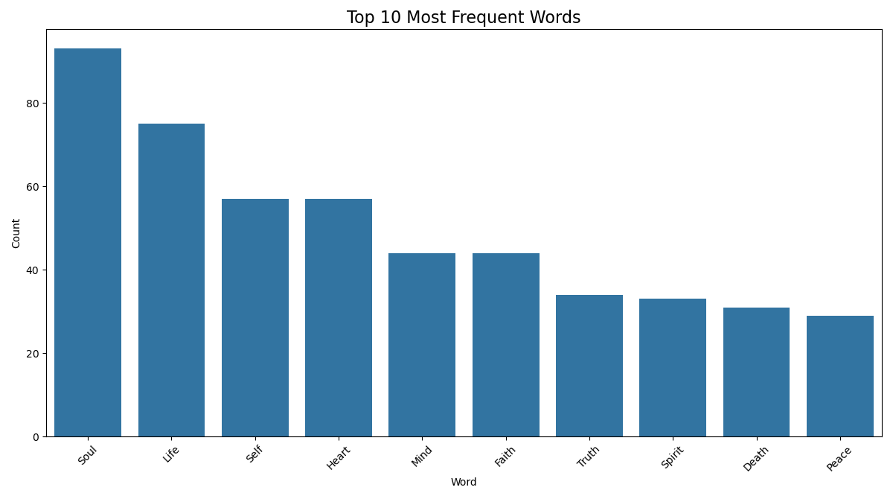
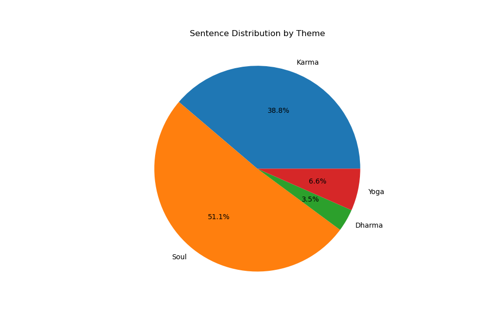

#  Parallel Text Handling Processor 

## **💡 Project Overview**
This project, Parallel Text Handling Processor (developed by Vishal Raman V ), is an efficient solution for analyzing large spiritual texts, specifically the Bhagavad Gita. It utilizes Regular Expressions (Regex) and Parallel Processing to automatically identify, count, and categorize recurring spiritual concepts, providing a structured and data-driven understanding of the scripture.

## **❓ Problem Statement**
Analyzing large, complex texts is challenging because key concepts and important ideas are often scattered throughout the content, making manual identification slow and inaccurate. For a text as dense as the Bhagavad Gita, locating every instance of core terms like karma, dharma, yoga, and soul throughout the entire book is extremely difficult to do by hand
## 🚀 How the Solution Works

The system processes the raw text file through a structured, multi-step NLP pipeline. All necessary output files, including databases, CSV reports, and plots, are generated automatically upon successful execution.

### **The 5-Module NLP Pipeline**

| Module | Description | Key Techniques Used |
| :--- | :--- | :--- |
| **1. Reader** | Reads the raw text content from the local `Bhagavad_geetha.txt` file. | File I/O |
| **2. Text Splitter** | Splits the entire text into meaningful, paragraph-based chunks for subsequent processing. | Text Chunking |
| **3. Checker Rule** | Applies **thematic rules** using **regex (pattern matching)** to classify sentences that reference core concepts like **Karma**, **Dharma**, **Yoga**, and **Soul**. | Rule-Based NLP, Regex |
| **4. Scorer** | Performs **parallel word frequency counting** and **thematic sentence categorization**. Stores all processing results into a database. | Parallel Processing (`concurrent.futures`), Tokenization (`nltk`) |
| **5. Aggregator / Output Builder** | Builds and generates the final output artifacts. | Database, CSV, Chart Generation |

---

## 🛠️ Libraries / Tools Used

The project relies on a mix of Python's standard libraries for core functionality and external libraries for advanced NLP and visualization.

### **External Libraries**

| Library | Purpose | Installation |
| :--- | :--- | :--- |
| **nltk** | Tokenization, sentence processing, and text analysis. | `pip install nltk` |
| **matplotlib** | Generation of charts and plots (e.g., bar and pie charts). | `pip install matplotlib` |
| **seaborn** | Enhanced styling and aesthetics for the bar graph. | `pip install seaborn` |
| *pandas* (Optional) | Can be utilized for advanced CSV/data handling. | `pip install pandas` |

### **Python Standard Libraries**

* `collections`: For efficient data aggregation (e.g., counting word frequencies).
* `csv`: For writing data to CSV files.
* `re`: For **regex** pattern matching in the `Checker Rule` module.
* `sqlite3`: For creating and managing the internal databases.
* `concurrent.futures`: For enabling **parallel processing** in the `Scorer` module.

### **Development Tools**

* **Python 3.8+**
* **Git / GitHub** (for version control)
* **VS Code or PyCharm** (for development)

---

## 📌 Steps to Run the Program

Follow these steps to set up and run the project on your local machine.

### **1️⃣ Install Python**

Ensure you have **Python 3.8 or a newer version** installed.

```bash
python --version
```
### **2️⃣ Install Required Python Libraries**
Install the necessary external libraries using **pip**:

```bash
pip install nltk matplotlib seaborn
```

Before running the main script, download the NLTK tokenizer:
```python
import nltk
nltk.download('punkt')
```

### **3️⃣ Place the Required Files**

Navigate to your desired project directory (e.g., D:\infosys_project\) and place the following files there:

* **Bhagavad_geetha.txt** (The full text input file)
* **project.py** (The main Python script)


### **4️⃣ Run the Program**
Open your Command Prompt (CMD) or PowerShell, change the directory, and run the main script:
```bash
cd D:\infosys_project
python project.py
```

### **5️⃣ View Output Files**

Upon successful execution, the program will automatically generate the following artifacts in the same directory:

| Output File | Purpose | File Type |
| :--- | :--- | :--- |
| `text_chunks.db` | Stores all the paragraph-based text chunks. | SQLite Database |
| `result.db` | Stores the final word count and thematic results. | SQLite Database |
| `chunk_info.csv` | Detailed information and metadata about each text chunk. | CSV Report |
| `parallel_sorted_word_counts.csv` | The final word frequency results, sorted. | CSV Report |


---

## 🧾 Sample Output and Visualizations

The terminal output provides a quick summary of the processing steps and results:

Extracting text...

✓ Total chunks created: 358


Counting words using parallel processing...


✓ Word counting completed.
Total Occurrences of Each Word (Sorted by Count from Parallel Processing):

Soul: 93

Life: 75

Self: 57

Heart: 57

Mind: 44

Faith: 44

Truth: 34

Spirit: 33

Death: 31

Peace: 29

God: 25

Wisdom: 24

Knowledge: 22

Body: 21

Desire: 19

Action: 15

Path: 9

Yoga: 7

Karma: 4

Dharma: 0

Rebirth: 0
<p align="center">
    
</p>
Categorizing sentences...

✓ 88 karma sentences

✓ 116 soul sentences

✓ 15 yoga sentences

✓ 8 dharma sentences
<p align="center">
    
</p>
